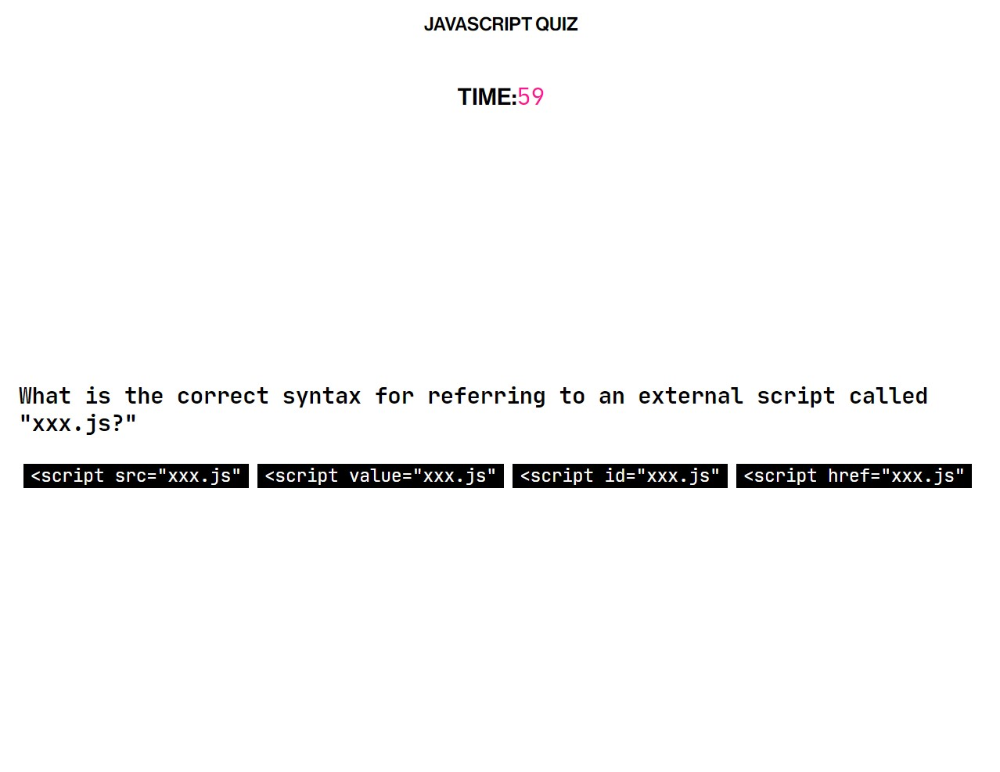

# Javascript Quiz

This application is a one minute code quiz with multiple-choice questions. Users are able to save their scores to a highscore list if the quiz is completed within the time limit. If the timer runs out, the user is not prompted to save their score, and instead asked to restart the quiz at no penalty. The design is simple, but interactive - correct and incorrect answers change colors when clicked, and all buttons change color on hover.

## User Story

```
AS A coding bootcamp student
I WANT to take a timed quiz on JavaScript fundamentals that stores high scores
SO THAT I can gauge my progress compared to my peers
```

```
GIVEN I am taking a code quiz
WHEN I click the start button
THEN a timer starts and I am presented with a question
WHEN I answer a question
THEN I am presented with another question
WHEN I answer a question incorrectly
THEN time is subtracted from the clock
WHEN all questions are answered or the timer reaches 0
THEN the game is over
WHEN the game is over
THEN I can save my initials and score
```

The following demonstrates the application functionality when the quiz is started:



### Deployed application: https://ya1sec.github.io/codequiz/

Ankit Bagchi
